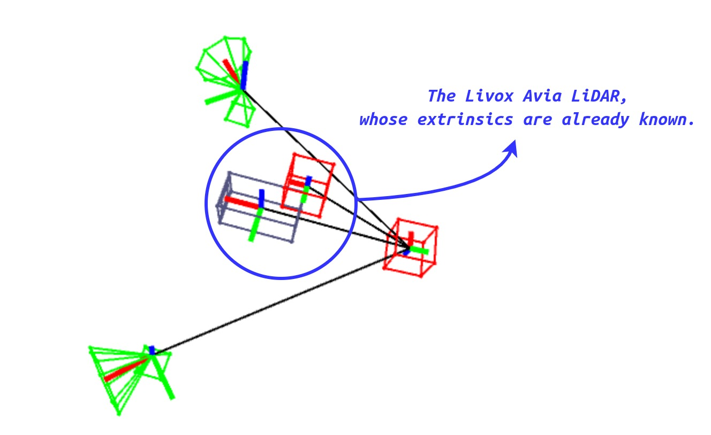

---

<h3 align="center">Lastest News About iKalibr</h3>

    <a href="https://github.com/Unsigned-Long"><strong>Author » Shuolong Chen</strong></a>

---

    <a><strong>Version 1.1.0 » Support Spatial & Temporal Priori Constraints</strong></a>

For a multi-sensor kit to be calibrated, if *the user already knows any spatiotemporal parameters between some sensors*, the user can pass these parameters into `iKalibr` by configuring this file, and this would treat the spatiotemporal calibration problem in `iKalibr` as an equality constraint optimization problem with prior information, to ensure that the solution meets the prior spatiotemporal parameters.

A typical example of using this file is to calibrate a multi-sensor kit containing `Livox Avia`. Since the manufacturer has provided the extrinsics of the IMU relative to the LiDAR in Avia, these extrinsics can be passed into ikalibr as a priori. 

*"The origin O' of IMU coordinate is defined in the point cloud coordinates as (-41.65, -23.26, 28.40) (Unit: mm).", from **Livox AVIA User Manual***.

To pass the spatiotemporal priori, please edit the [config file](../../config/spat-temp-priori.yaml) and give its path to the `SpatTempPrioriPath` field in the main config file of `iKalibr`.

**Attention:** 

+ Please note that this prior knowledge is not necessary in `iKalibr`. If *you have them and are very sure that they are correct*, then provide it to `iKalibr` through this file. If you don't have them, don't need to provide  the corresponding configure file.
+ The new feature in `iKalibr` (support for prior constraints) is theoretically a nonlinear least squares problem with equality constraints. Technically, it can be implemented through [Augmented Lagrangian](https://en.wikipedia.org/wiki/Augmented_Lagrangian_method) or [Sequential Quadratic Programming (SQP)](https://en.wikipedia.org/wiki/Sequential_quadratic_programming). Unfortunately, `Ceres` does not currently support this type of constrained optimization problem. Therefore, in terms of implementation, we directly treat this prior constraint as a residual with a large weight, which is also the suggestion given by `Ceres` developers.

