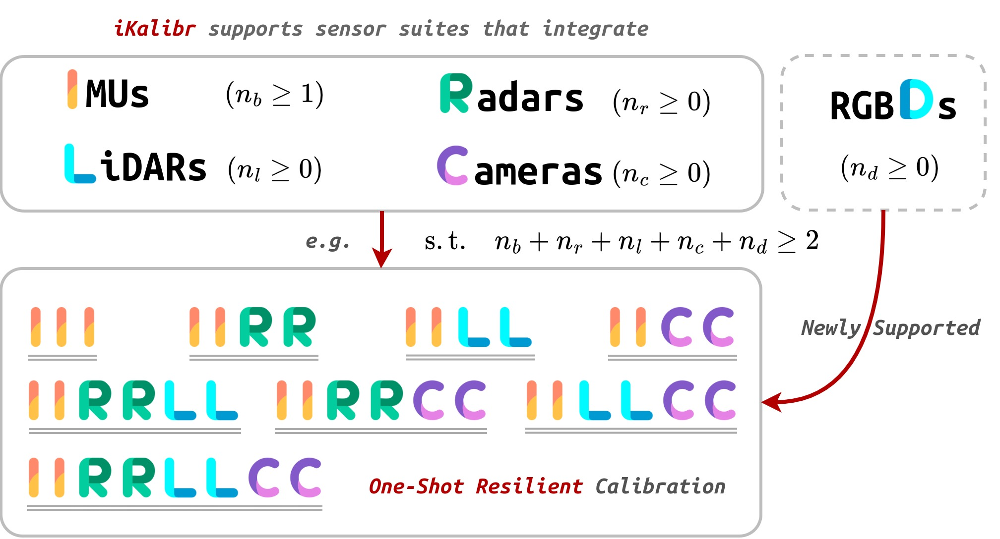

---

<h3 align="center">Why iKalibr Is Named As iKalibr</h3>

    <a href="https://github.com/Unsigned-Long"><strong>Author » Shuolong Chen</strong></a>

---

    <a><strong>The Naming of Kalibr »</strong></a>

The `Kalibr` calibration toolbox is an open-source project developed by the *ETH Zurich Visual Computing Group*. It addresses visual-inertial-related calibration problems. The name `Kalibr` is indeed inspired by the Swedish word “*Kalibrering*”, which translates to “*calibration*”. It’s a fitting choice for a toolbox that focuses on camera and sensor calibration.

The most notable feature of `Kalibr` is the introduction of an artificial calibration target during the calibration process for efficient and accurate motion recovery and optimization.

As a well-known calibration toolbox, `Kalibr` has made great contributions in both academia and industry. 

    <a><strong>The Naming of iKalibr (Ours) »</strong></a>

As a calibrator, `iKalibr` focuses on continuous-time-based multi-sensor spatiotemporal determination. More specifically, `iKalibr` addresses calibration problems for resilient integrated inertial systems, which generally integrate several exteroceptive (such as cameras, LiDARs, and radars) and proprioceptive (IMU, here) sensors, see the following figure. 

Since `iKalibr` focuses on inertial systems, where at least one IMU is required in the suite, the first letter of `iKalibr` is a lowercase `i`, to better draw users’ attention to this. The most notable point of `iKalibr` different from `Kalibr` is that `iKalibr` is a targetless one, which means no artificial calibration target is required for spatiotemporal calibration, such as chessboards for cameras, geometries for LiDARs, or reflectors for radars. All you need to do for calibration is hold up your sensor suite and shake it for half a minute to a minute for data collection and further solving in `iKalibr`. Meanwhile, note that `iKalibr` supports more sensor suites, benefiting from its resilient calibration capability.

All right, explained so much, we just want to point out that `iKalibr` and `Kalibr` are really different. However, we have to admit that the naming of `iKalibr` is with a little intention to follow `Kalibr`.