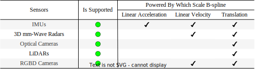
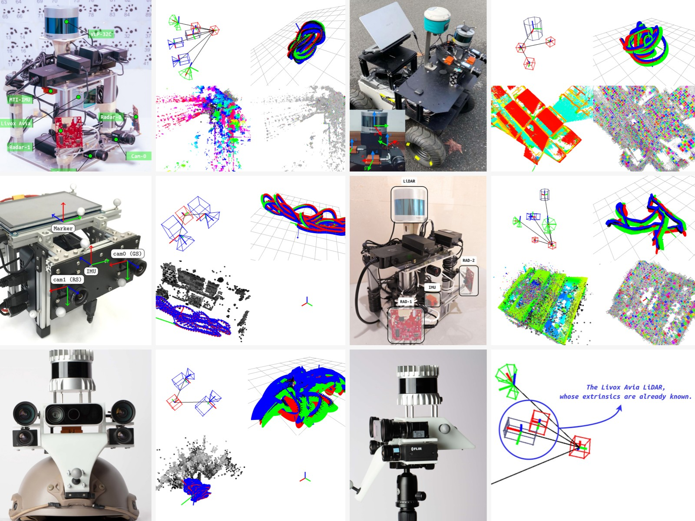
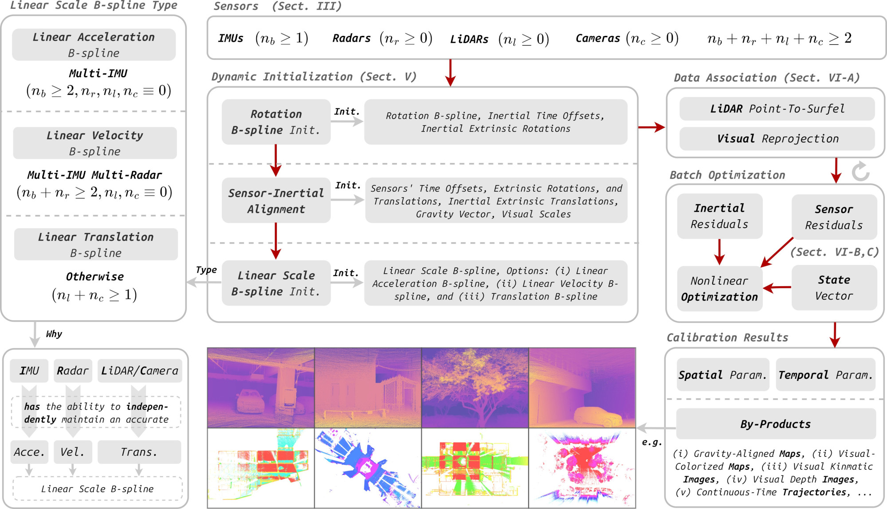

    

---

<h3 align="center">iKalibr: Unified Targetless Spatiotemporal Calibration Framework</h3>

    <a href="https://github.com/Unsigned-Long"><strong>Author » Shuolong Chen</strong></a>

<i>"The naming of <strong>iKalibr</strong> is inspired by <a href="https://github.com/ethz-asl/kalibr.git">Kalibr</a>, but not an extension of it. Wonder <a href="./docs/details/why_ikalibr.md">why</a>?"</i>

    :tada: <a href="./docs/details/news.md"><i><strong>News »</strong> A docker image of iKalibr is released!</i></a>

---

`iKalibr` is a spatiotemporal calibration framework focusing on resilient integrated inertial systems (sensor suite integrates at least one IMU), the features of `iKalibr` are listed as follows:

+ ***Targetless***: requires no additional artificial targets or facilities. This is perhaps the biggest difference between `iKalibr` and [Kalibr](https://github.com/ethz-asl/kalibr.git) (Kalibr is a chessboard-based visual-inertial calibrator).
+ ***Spatiotemporal***: determines both spatial (extrinsic rotations and translations) and temporal (time offsets, readout time of RS cameras) parameters.
+ ***Resilient and compact***: supports a wide range of sensor suites for one-shot resilient calibration. The <u>IMUs</u>, <u>radars</u>, <u>LiDARs</u>, <u>optical cameras</u> (both [GS](https://www.arducam.com/global-shutter-camera/) and [RS](https://en.wikipedia.org/wiki/Rolling_shutter) modes), and <u>depth cameras</u> (RGBDs, newly supported), are supported currently. See the following illustration of the full pipeline. "Compact" means that no additional sensors are required to calibrate a given sensor suite.
+ ***Easy to extend***: `iKalibr` is a general spatiotemporal calibration pipeline, and easy to extend to support other sensor types, such as the popular [event](https://en.wikipedia.org/wiki/Event_camera) cameras.

For more details, please refer to our article :point_down::

+ **S. Chen**, X. Li*, S. Li\*, Y. Zhou, and X. Yang, "iKalibr: Unified Targetless Spatiotemporal Calibration for Resilient Integrated Inertial Systems," in IEEE Transactions on Robotics (TRO), 2025. [[paper-tro](https://ieeexplore.ieee.org/document/10848334)] [[paper-arXiv](https://arxiv.org/abs/2407.11420)] [[video 1](https://www.bilibili.com/video/BV1Dm421G7FV)] [[video 2](https://www.bilibili.com/video/BV1MFUGYGEpU)]
+ **S. Chen**, X. Li*, S. Li and Y. Zhou, "iKalibr-RGBD: Partially-Specialized Target-Free Visual-Inertial Spatiotemporal Calibration For RGBDs via Continuous-Time Velocity Estimation," in IEEE Robotics and Automation Letters (RA-L), 2024. [[paper-ral](https://ieeexplore.ieee.org/document/10759744)] [[paper-arXiv](http://arxiv.org/abs/2409.07116)]

---

    <a href="https://www.bilibili.com/video/BV1Dm421G7FV"><strong>« Demonstration Video of iKalibr »</strong></a>

 

<i>"Targetless, Spatial & Temporal, Resilient, Easy To Use, You Only Calibrate Once"</i>

    

---

---

---

    <a href="./docs/details/build_ikalibr.md"><strong>Tutorial: Prepare iKalibr Environment (Option 1) »</strong></a>

 

+ install available operation systems and required third libraries.
+ clone `iKalibr` and its submodules on github, compile submodules.
+ compile `iKalibr` (this would require some time).

    <a href="./docs/details/build_ikalibr_docker.md"><strong>Tutorial: Prepare iKalibr Environment Using Docker (Option 2) »</strong></a>

 

+ install docker and pull the docker image.
+ create a corresponding container using the image.
+ update (pull) `iKalibr` repo and recompile it if needed. 

    <a href="./docs/details/use_ikalibr.md"><strong>Tutorial: General Calibration Procedure in iKalibr »</strong></a>

 

+ collect sensor data dynamically, sufficiently excited motion is needed.
+ write adaptable configure file (a template file has been provided).
+ run `iKalibr` based on the configure file.

    <a href="./docs/details/tools.md"><strong>Additional Helpful Tools in iKalibr »</strong></a>

 

+ rosbag assembly before solving, such as raw inertial csv file or images to rosbag, merge or split rosbag.
+ data format transformation after solving, some visualization scripts.

    <a href="./docs/details/dataset.md"><strong>Dataset Utilized in iKalibr for Evaluation »</strong></a>

 

+ our dataset: two cameras, a Livox Avia lidar (with built-in IMU), a velodyne VLP-32C lidars, two mmWave 3D radars, a MTI IMU.
+ [LI-Calib (OA-Calib)](https://github.com/APRIL-ZJU/lidar_IMU_calib.git) dataset: a velodyne VLP-16 lidars, three IMUs.
+ [River](https://github.com/Unsigned-Long/River.git) dataset: two mmWave 3D radars, a MTI IMU.
+ [TUM GS-RS](https://cvg.cit.tum.de/data/datasets/rolling-shutter-dataset) dataset: a GS camera, a RS camera, a Bosch IMU.
+ [VECtor](https://star-datasets.github.io/vector) dataset: two optical cameras (with reprojected depth images), two event cameras, an Ouster OS0-128 LiDAR, a XSens MTi-30 AHRS IMU.

---

<h5 align="center">Copyright</h5>

---

<i>iKalibr: Unified Targetless Spatiotemporal Calibration Framework 
    Copyright 2024, the School of Geodesy and Geomatics (SGG), Wuhan University, China 
    https://github.com/Unsigned-Long/iKalibr.git </i>

<i>Author: <strong>Shuolong Chen</strong> (shlchen@whu.edu.cn) 
    GitHub: https://github.com/Unsigned-Long 
    ORCID: 0000-0002-5283-9057 </i>

*Redistribution and use in source and binary forms, with or without modification, are permitted provided that the following conditions are met:*

* *Redistributions of source code must retain the above copyright notice, this list of conditions and the following disclaimer.*
* *Redistributions in binary form must reproduce the above copyright notice, this list of conditions and the following disclaimer in the documentation and/or other materials provided with the distribution.*
* *Neither the name of the names of its contributors may be used to endorse or promote products derived from this software without specific prior written permission.*

*THIS SOFTWARE IS PROVIDED BY THE COPYRIGHT HOLDERS AND CONTRIBUTORS "AS IS" AND ANY EXPRESS OR IMPLIED WARRANTIES, INCLUDING, BUT NOT LIMITED TO, THE IMPLIED WARRANTIES OF MERCHANTABILITY AND FITNESS FOR A PARTICULAR PURPOSE ARE DISCLAIMED. IN NO EVENT SHALL THE COPYRIGHT OWNER OR CONTRIBUTORS BE LIABLE FOR ANY DIRECT, INDIRECT, INCIDENTAL, SPECIAL, EXEMPLARY, OR CONSEQUENTIAL DAMAGES (INCLUDING, BUT NOT LIMITED TO, PROCUREMENT OF SUBSTITUTE GOODS OR SERVICES; LOSS OF USE, DATA, OR PROFITS; OR BUSINESS INTERRUPTION) HOWEVER CAUSED AND ON ANY THEORY OF LIABILITY, WHETHER IN CONTRACT, STRICT LIABILITY, OR TORT (INCLUDING NEGLIGENCE OR OTHERWISE) ARISING IN ANY WAY OUT OF THE USE OF THIS SOFTWARE, EVEN IF ADVISED OF THE POSSIBILITY OF SUCH DAMAGE.*
